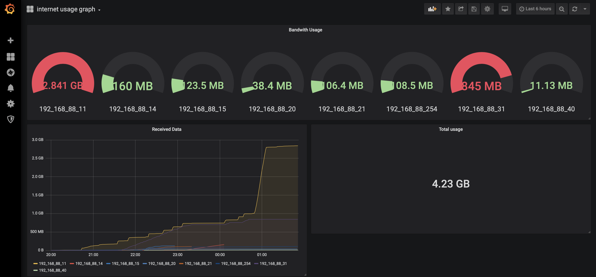

# Acumen

this is a solution for store and monitoring Internet Usage of mikrotik router clients

Acumen means **the ability to make good judgements and take quick decisions.**

## Getting Started
Acumen consists of three components:
- Collector: a nodejs script that poll usage from mikrotik cgi
- Database: a time-series database, currently only graphite is supported
- Grafana Dashboard: a simple grafana template

### Prerequisites
first of all, you need to Enable accounting feature of mikrotik router, 
there is a brief tutorial [here](Enabling_Accounting.md)

then you need to set retention and aggregation policy of your time-series db,
you can find a sample [here](configs/graphite/storage-schemas.conf#L24-L26) 
and [here](configs/graphite/storage-aggregation.conf#39-L42).

### Running
edit `config.js` to match your setup, then `npm run start`

### Run Using Docker
change `GF_SECURITY_ADMIN_PASSWORD` value in docker compose file, then `docker-compose up -d`

### Dashboard
grafana tmeplate is available at `configs/grafana/dashboard.yml`

first add graphite as datasource then import template